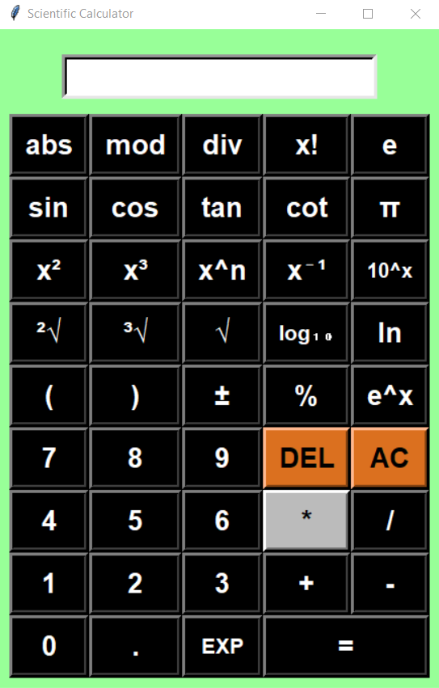

# Scientific Calculator

A fully-featured scientific calculator built using Python's Tkinter library. This calculator supports various mathematical operations including trigonometric functions, factorials, logarithms, and more. 

## Screenshots

  <!-- Add a screenshot image of your game here -->

## Features

- **Basic Arithmetic Operations**: Addition, Subtraction, Multiplication, and Division
- **Factorial Calculation**: Computes the factorial of a number
- **Trigonometric Functions**: Sine, Cosine, Tangent, and Cotangent
- **Roots Calculation**: Square root and Cube root
- **Percentage Calculation**: Converts a number to its percentage
- **Power Operations**: Exponentiation and inverse
- **Logarithms**: Base-10 and natural logarithms
- **Scientific Notation**: Handles powers of 10 and e
- **Sign Change**: Toggle between positive and negative values

## Requirements

- Python 3.x
- Tkinter (usually comes pre-installed with Python)

